## 计算机毕业设计吊打答辩现场hadoop+spark知识图谱音乐推荐系统 音乐预测系统 音乐可视化 音乐数据分析 音乐爬虫 音乐大屏 音乐大数据 大数据毕业设计 大数据毕业设计 大数据毕设 机器学习 深度学习 人工智能

## 要求
### 源码有偿！一套(论文 PPT 源码+sql脚本+教程)

# 运行视频(B站)演示

https://www.bilibili.com/video/BV1tV4y1q7RJ/?spm_id_from=333.999.0.0

### 
### 加好友前帮忙start一下，并备注github有偿音乐推荐图谱
### 我的QQ号是2827724252或者798059319或者 1679232425或者微信:bysj2023nb

# 

### 加qq好友说明（被部分 网友整得心力交瘁）：
    1.加好友务必按照格式备注
    2.避免浪费各自的时间！
    3.当“客服”不容易，repo 主是体面人，不爆粗，性格好，文明人。

适合地狱级难度，从头到尾吊打导师！

干死中国这帮杂种导师！完全弱智张口喷来喷去！吃屎东西！什么鸡巴技术不会就会用嘴写代码！可操死他妈把！那就用我的项目摩擦吊打他！

# 开发技术
Hadoop、Spark、SparkSQL、Python、MySQL、协同过滤算法、皮尔逊相关系数、KNN、echarts可视化、阿里云短信接口、支付宝沙箱支付、百度AI身份证自动识别、SpringBoot、Vue.js、MyBatis-Plus

# 特色/创新点
大屏统计可视化

用户网页端(实时推荐)

Python爬虫

机器学习离线计算分析

短信接口修改密码或者注册

支付宝沙箱支付(网页、app都实现了)

身份证自动识别认证

新增知识图谱neo4j

KNN CNN卷积神经预测音乐热度流量

SVD神经网络进行音乐推荐算法实现

....10-50种创新点

# 运行截图

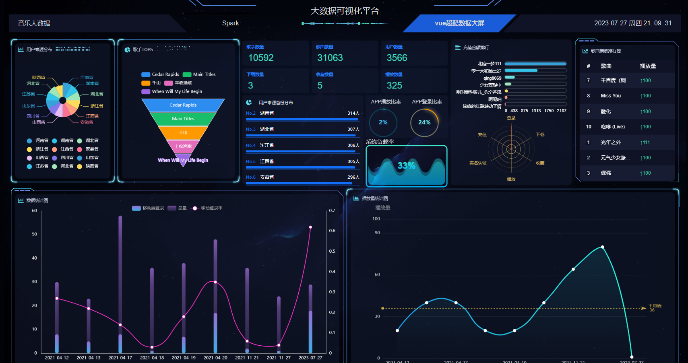
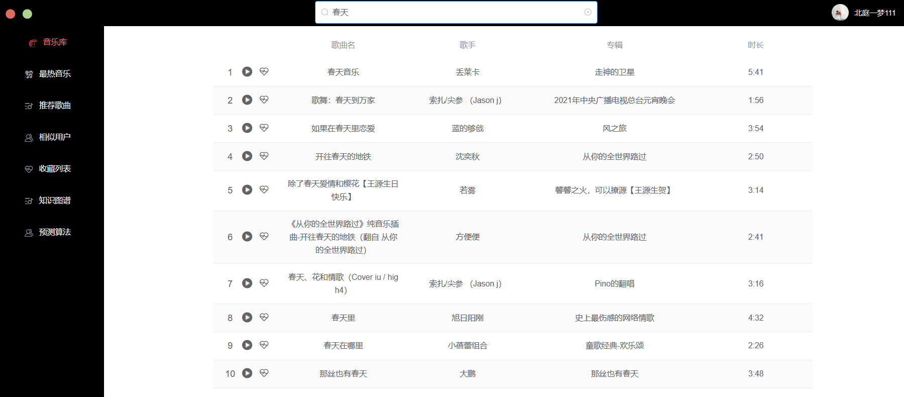
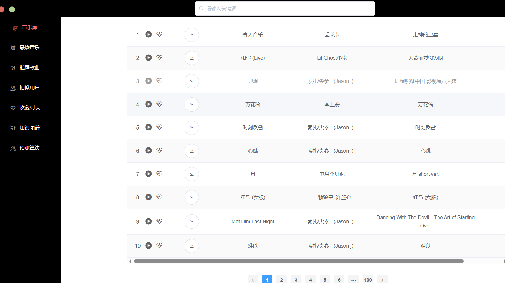
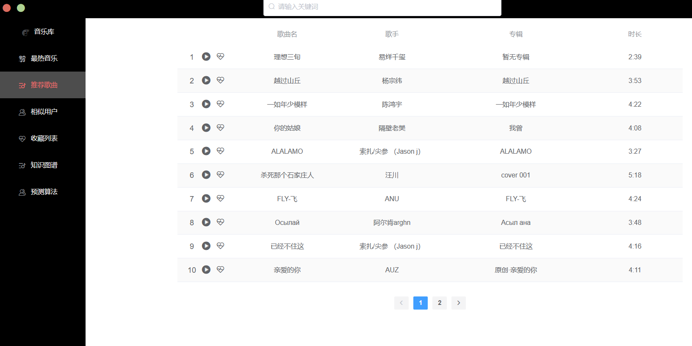
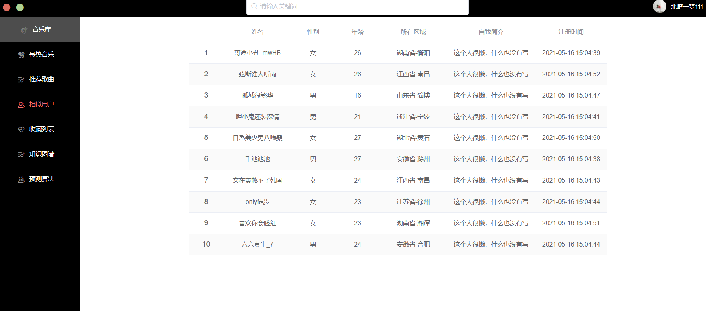
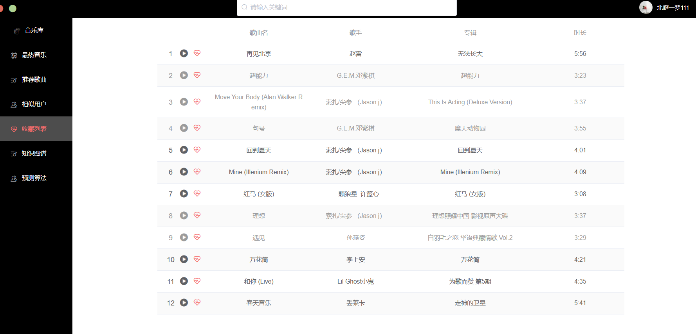
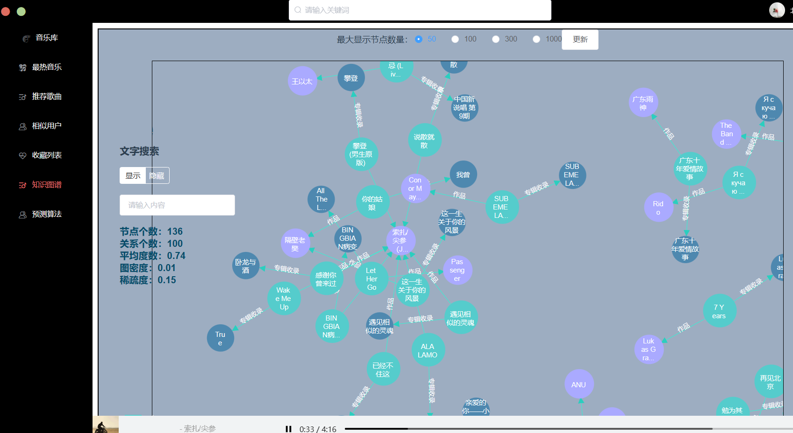
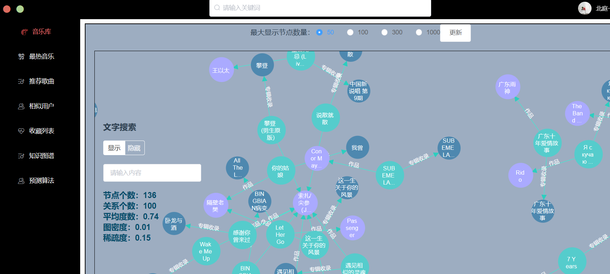
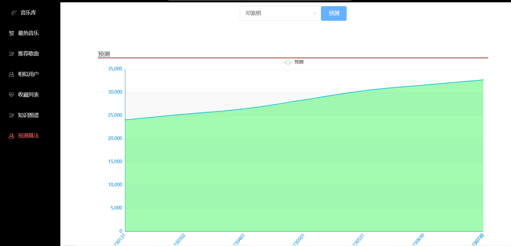
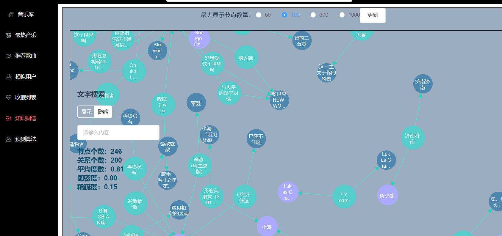
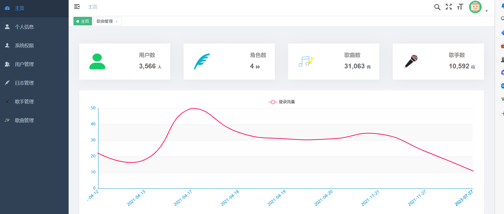
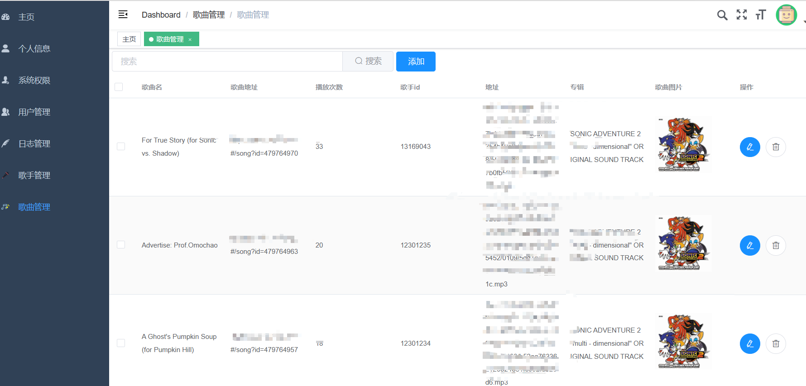
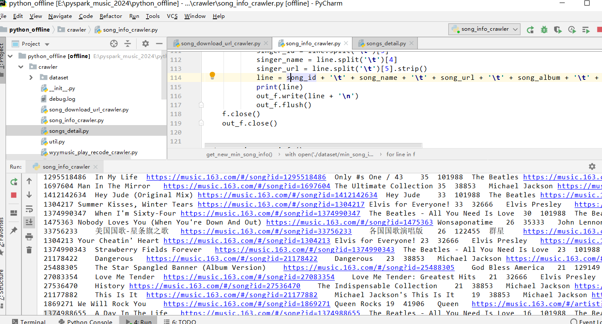
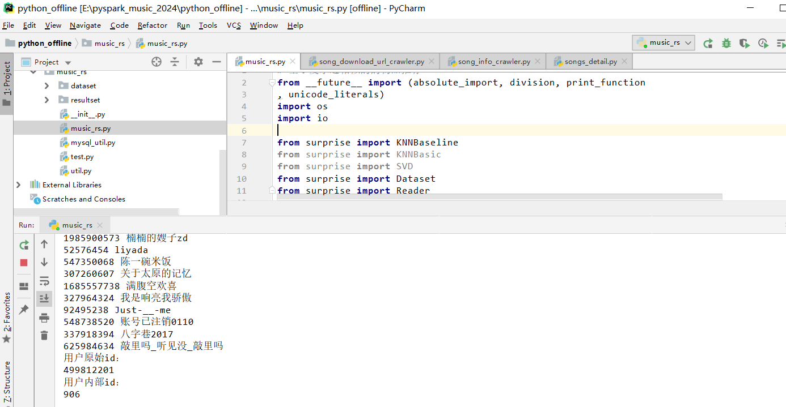
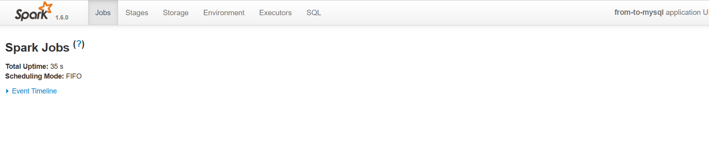

# 运行视频(B站)

https://www.bilibili.com/video/BV1tV4y1q7RJ/?spm_id_from=333.999.0.0

